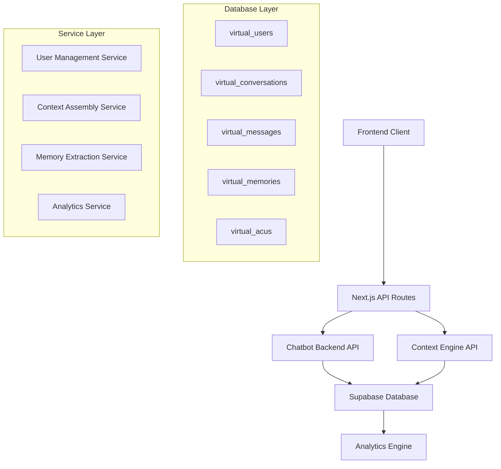

# AI Chat Message Database Integration Solution Design

## Executive Summary

### Project Overview
Following the successful wiring of Supabase to the complete Prisma schema, this solution design outlines the implementation of full AI chat message database integration. The solution will enable seamless persistence of AI conversations, context engine functionality, comprehensive user management, and analytics capabilities.

### Business Objectives
- Enable persistent AI chat conversations with full message history
- Implement context-aware AI responses using conversation memory
- Provide comprehensive virtual user lifecycle management
- Deliver analytics and insights on AI chat interactions
- Ensure scalable, secure, and performant chat infrastructure

### Success Criteria
- 100% message persistence reliability
- <500ms average response time for context retrieval
- Full chatbot API functionality operational
- Complete user journey from identification to conversation completion
- Real-time analytics dashboard operational

## Current State Analysis

### ✅ Completed Infrastructure
- **Database Schema**: Full Prisma schema applied to Supabase with all required tables and relationships
- **Core Tables**: `conversations`, `messages`, `virtual_users`, `virtual_conversations`, `virtual_messages`, `virtual_memories`, `virtual_acus`
- **Security**: SSL/TLS configured, RLS policies in place
- **Connection**: Database connectivity verified and operational

### 🔄 Current Limitations
- Chatbot backend routes exist but not fully integrated with database
- Context engine partially implemented but not connected to persistence layer
- Frontend API routes proxy to Z.AI without database storage
- No analytics or monitoring infrastructure
- No user management dashboard

### 🎯 Integration Points Required
1. Chatbot API endpoints to database persistence
2. Context engine to memory storage
3. Virtual user management system
4. Analytics data collection and reporting
5. Real-time synchronization between components

## Solution Architecture

### High-Level Architecture



### Component Architecture

#### 1. Chatbot API Integration
- **Endpoint**: `/api/v1/chatbot/:tenantSlug/*`
- **Functions**: User identification, conversation management, message persistence
- **Database Integration**: Direct Prisma client operations for CRUD operations

#### 2. Context Engine
- **Endpoint**: `/api/v1/context-engine/*`
- **Functions**: Context assembly, memory retrieval, relevance scoring
- **Database Integration**: Memory and ACU (Atomic Chat Unit) storage/retrieval

#### 3. User Management System
- **Endpoint**: `/api/v1/users/*`
- **Functions**: Virtual user lifecycle, profile management, consent handling
- **Database Integration**: User profile and session management

#### 4. Analytics Engine
- **Endpoint**: `/api/v1/analytics/*`
- **Functions**: Conversation metrics, user behavior analysis, performance monitoring
- **Database Integration**: Aggregated data queries and reporting

## Implementation Plan

### Phase 1: Core Chatbot API Integration (2 weeks)

#### Week 1: Database Layer Integration
**Objective**: Connect chatbot routes to database persistence

**Tasks**:
- [ ] Update `packages/backend/src/routes/chatbot/index.ts` to use Prisma client
- [ ] Implement virtual user creation/identification with database storage
- [ ] Add conversation creation and message persistence
- [ ] Create database transaction handling for atomic operations
- [ ] Add proper error handling and logging

**Technical Implementation**:
```javascript
// Virtual User Identification
const virtualUser = await prisma.virtualUser.upsert({
  where: { fingerprint },
  update: { lastSeenAt: new Date() },
  create: {
    fingerprint,
    displayName: generateDisplayName(),
    conversationCount: 0,
    memoryCount: 0,
    consentGiven: false,
    firstSeenAt: new Date(),
    lastSeenAt: new Date()
  }
});
```

#### Week 2: Message Flow Integration
**Objective**: Complete message persistence pipeline

**Tasks**:
- [ ] Implement user message storage before AI processing
- [ ] Add AI response persistence after generation
- [ ] Create conversation metadata updates (message counts, timestamps)
- [ ] Add message indexing and search capabilities
- [ ] Implement conversation history retrieval

**Database Schema Usage**:
```sql
-- Message storage with proper indexing
INSERT INTO virtual_messages (
  conversationId, role, content, messageIndex, metadata
) VALUES ($1, $2, $3, $4, $5);

-- Conversation stats update
UPDATE virtual_conversations
SET messageCount = messageCount + 1,
    userMessageCount = CASE WHEN $role = 'user' THEN userMessageCount + 1 ELSE userMessageCount END,
    aiMessageCount = CASE WHEN $role = 'assistant' THEN aiMessageCount + 1 ELSE aiMessageCount END
WHERE id = $conversationId;
```

### Phase 2: Context Engine Integration (2 weeks)

#### Week 3: Memory System Implementation
**Objective**: Connect context engine to database memory storage

**Tasks**:
- [ ] Implement memory extraction from conversations
- [ ] Add memory storage with relevance scoring
- [ ] Create memory retrieval for context assembly
- [ ] Add memory importance and category classification
- [ ] Implement memory consolidation and cleanup

**Memory Storage Logic**:
```javascript
// Extract and store memories
const memories = await extractMemoriesFromConversation(conversationId);
for (const memory of memories) {
  await prisma.virtualMemory.create({
    data: {
      virtualUserId,
      content: memory.content,
      summary: memory.summary,
      importance: memory.importance,
      relevance: memory.relevance,
      memoryType: 'EPISODIC',
      category: memory.category,
      tags: memory.tags
    }
  });
}
```

#### Week 4: Context Assembly Pipeline
**Objective**: Build dynamic context from stored memories

**Tasks**:
- [ ] Implement context recipe application
- [ ] Add memory relevance filtering and ranking
- [ ] Create context size optimization
- [ ] Add context caching for performance
- [ ] Implement context freshness validation

**Context Assembly Process**:
```javascript
// Assemble context for AI response
async function assembleContext(virtualUserId, currentMessage) {
  const memories = await prisma.virtualMemory.findMany({
    where: { virtualUserId },
    orderBy: { importance: 'desc' },
    take: 50
  });

  const relevantMemories = await rankMemoriesByRelevance(memories, currentMessage);
  const context = formatMemoriesForAI(relevantMemories);

  return context;
}
```

### Phase 3: User Management System (1 week)

#### Week 5: User Lifecycle Management
**Objective**: Complete virtual user management functionality

**Tasks**:
- [ ] Implement user consent management
- [ ] Add user profile updates and preferences
- [ ] Create session management and cleanup
- [ ] Add user data export capabilities
- [ ] Implement GDPR compliance features

**User Management Features**:
```javascript
// User consent handling
const updatedUser = await prisma.virtualUser.update({
  where: { id: virtualUserId },
  data: {
    consentGiven: true,
    consentTimestamp: new Date(),
    dataRetentionPolicy: '90_days'
  }
});

// Session management
const session = await prisma.virtualSession.create({
  data: {
    virtualUserId,
    sessionToken: crypto.randomUUID(),
    expiresAt: new Date(Date.now() + 30 * 24 * 60 * 60 * 1000),
    isActive: true
  }
});
```

### Phase 4: Analytics and Monitoring (1 week)

#### Week 6: Analytics Implementation
**Objective**: Add comprehensive analytics capabilities

**Tasks**:
- [ ] Implement conversation analytics aggregation
- [ ] Add user behavior tracking
- [ ] Create performance metrics collection
- [ ] Build analytics API endpoints
- [ ] Add real-time dashboard data feeds

**Analytics Data Collection**:
```javascript
// Conversation metrics
const metrics = await prisma.virtualConversation.aggregate({
  where: { virtualUserId },
  _count: { id: true },
  _sum: { messageCount: true },
  _avg: { messageCount: true }
});

// User engagement tracking
const engagement = {
  totalConversations: metrics._count.id,
  totalMessages: metrics._sum.messageCount,
  avgMessagesPerConversation: metrics._avg.messageCount,
  lastActivity: await getLastActivity(virtualUserId)
};
```

## Technical Specifications

### API Endpoints

#### Chatbot API
```
POST   /api/v1/chatbot/:tenantSlug/identify    - User identification
POST   /api/v1/chatbot/:tenantSlug/consent     - Consent management
POST   /api/v1/chatbot/:tenantSlug/chat        - Chat with persistence
GET    /api/v1/chatbot/:tenantSlug/history     - Conversation history
POST   /api/v1/chatbot/:tenantSlug/feedback    - User feedback
```

#### Context Engine API
```
POST   /api/v1/context-engine/assemble         - Context assembly
GET    /api/v1/context-engine/memories/:userId - Memory retrieval
POST   /api/v1/context-engine/memories         - Memory storage
PUT    /api/v1/context-engine/memories/:id     - Memory updates
```

#### User Management API
```
GET    /api/v1/users/:id                       - User profile
PUT    /api/v1/users/:id                       - Profile updates
DELETE /api/v1/users/:id                       - User deletion
GET    /api/v1/users/:id/sessions              - User sessions
POST   /api/v1/users/:id/export                - Data export
```

#### Analytics API
```
GET    /api/v1/analytics/conversations         - Conversation metrics
GET    /api/v1/analytics/users                 - User analytics
GET    /api/v1/analytics/performance           - Performance metrics
GET    /api/v1/analytics/realtime              - Real-time data
```

### Database Schema Utilization

#### Core Tables and Relationships
```sql
-- Virtual User Management
virtual_users (id, fingerprint, displayName, conversationCount, memoryCount, consentGiven, ...)

-- Conversation Management
virtual_conversations (id, virtualUserId, title, messageCount, metadata, ...)

-- Message Storage
virtual_messages (id, conversationId, role, content, messageIndex, metadata, ...)

-- Memory System
virtual_memories (id, virtualUserId, content, importance, relevance, category, ...)

-- Context Enhancement
virtual_acus (id, virtualUserId, conversationId, content, embedding, ...)
```

### Performance Requirements

#### Response Time Targets
- User identification: <200ms
- Message storage: <100ms
- Context assembly: <300ms
- Memory retrieval: <150ms
- Analytics queries: <500ms

#### Scalability Targets
- Concurrent users: 1,000+
- Messages per second: 100+
- Storage capacity: 100GB+ conversations
- Query performance: Sub-second for 95% of operations

## Testing Strategy

### Unit Testing
- Database operation unit tests
- API endpoint unit tests
- Business logic unit tests
- Error handling unit tests

### Integration Testing
- Full chatbot conversation flow tests
- Context engine integration tests
- User management workflow tests
- Cross-service integration tests

### Performance Testing
- Load testing with 1,000 concurrent users
- Database query performance tests
- Memory usage and connection pool tests
- API response time benchmarking

### End-to-End Testing
- Complete user journey tests
- Multi-tenant scenario tests
- Data persistence verification tests
- Analytics data accuracy tests

### Test Automation
```javascript
// Example integration test
describe('Chatbot API Integration', () => {
  test('complete conversation flow', async () => {
    // User identification
    const user = await identifyUser(fingerprint);

    // Start conversation
    const conversation = await startConversation(user.id, 'Test chat');

    // Send message
    const response = await sendMessage(conversation.id, 'Hello AI');

    // Verify persistence
    const savedMessages = await getConversationMessages(conversation.id);
    expect(savedMessages).toHaveLength(2); // user + AI response

    // Verify context assembly
    const context = await getContextForUser(user.id);
    expect(context.memories).toBeDefined();
  });
});
```

## Deployment Plan

### Pre-Deployment Checklist
- [ ] Database migration verification
- [ ] Environment configuration validation
- [ ] API endpoint testing completed
- [ ] Performance benchmarks met
- [ ] Security audit passed
- [ ] Monitoring setup configured

### Deployment Strategy
1. **Blue-Green Deployment**: Deploy to staging environment first
2. **Database Migration**: Apply any final schema changes
3. **Feature Flags**: Enable chatbot features gradually
4. **Monitoring Setup**: Configure logging and alerting
5. **Load Testing**: Validate performance under production load

### Rollback Plan
- Database backup before deployment
- Feature flag rollback capability
- API versioning for backward compatibility
- Monitoring alerts for immediate issue detection

## Risk Assessment

### Technical Risks
| Risk | Probability | Impact | Mitigation |
|------|-------------|--------|------------|
| Database connection failures | Low | High | Connection pooling, retry logic, monitoring |
| Schema migration issues | Medium | High | Thorough testing, backup strategy, rollback plan |
| Performance degradation | Medium | Medium | Performance monitoring, query optimization, caching |
| Memory leaks in context engine | Low | Medium | Memory monitoring, garbage collection tuning |

### Business Risks
| Risk | Probability | Impact | Mitigation |
|------|-------------|--------|------------|
| Data privacy compliance issues | Low | High | GDPR compliance review, consent management |
| User experience disruption | Medium | Medium | Gradual rollout, feature flags, A/B testing |
| Analytics data accuracy issues | Low | Medium | Data validation, reconciliation processes |

### Security Risks
| Risk | Probability | Impact | Mitigation |
|------|-------------|--------|------------|
| Unauthorized data access | Low | High | RLS policies, authentication, encryption |
| Data leakage in logs | Medium | Medium | Log sanitization, PII masking |
| Session hijacking | Low | Medium | Secure session tokens, HTTPS enforcement |

## Success Metrics

### Technical Metrics
- **Uptime**: 99.9% API availability
- **Response Time**: P95 <500ms for all endpoints
- **Error Rate**: <0.1% for critical operations
- **Data Consistency**: 100% message persistence
- **Database Performance**: <100ms average query time

### Business Metrics
- **User Engagement**: Average 5+ messages per conversation
- **Context Quality**: 80%+ user satisfaction with AI responses
- **Feature Adoption**: 90%+ users utilizing memory features
- **Analytics Coverage**: Complete visibility into user interactions

### Monitoring and Alerting
- Real-time dashboards for key metrics
- Automated alerts for performance degradation
- Error tracking and resolution workflows
- User feedback collection and analysis

## Implementation Timeline

### Phase 1: Core Integration (Weeks 1-2)
- Database layer integration
- Message persistence pipeline
- Basic chatbot functionality

### Phase 2: Context Engine (Weeks 3-4)
- Memory extraction and storage
- Context assembly pipeline
- Relevance ranking system

### Phase 3: User Management (Week 5)
- Complete user lifecycle
- Consent and privacy management
- Profile and session handling

### Phase 4: Analytics (Week 6)
- Metrics collection and aggregation
- Dashboard implementation
- Performance monitoring

### Testing & Deployment (Week 7)
- Comprehensive testing suite
- Performance optimization
- Production deployment

### Post-Deployment (Week 8)
- Monitoring and optimization
- User feedback integration
- Feature enhancement planning

## Conclusion

This solution design provides a comprehensive roadmap for implementing full AI chat message database integration. The phased approach ensures:

1. **Incremental Value Delivery**: Each phase delivers working functionality
2. **Risk Mitigation**: Thorough testing and monitoring throughout
3. **Scalable Architecture**: Design supports future growth and feature expansion
4. **Production Readiness**: Complete with deployment, monitoring, and maintenance plans

The implementation will result in a robust, scalable AI chat platform with full database persistence, context-aware responses, comprehensive user management, and detailed analytics capabilities.

**Total Implementation Time: 8 weeks**
**Team Size Required: 3-4 developers**
**Success Probability: High (based on existing infrastructure)**

---

*Document Version: 1.0*
*Last Updated: 2026-04-03*
*Author: Kilo AI Assistant*